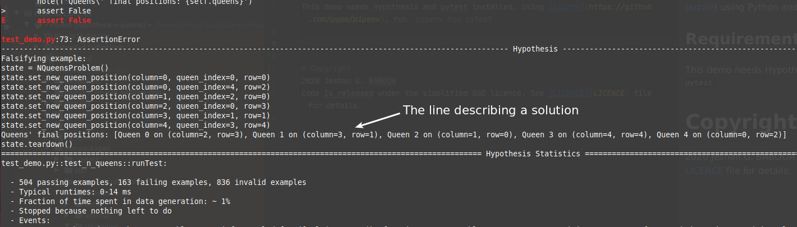

# N queens problem (Hypothesis example)

This project demonstrates how to solve the N-queens problem (aka the [8 queens puzzle](https://en.wikipedia.org/wiki/Eight_queens_puzzle)) using Python and the Hypothesis library.

## Requirements

This demo needs Hypothesis and pytest installed. Using [pipenv](https://github.com/pypa/pipenv), run `pipenv run pytest`.

You should then see:

# Copyright
2020 Jeshan G. BABOOA

Code is released under the simplified BSD licence. See [LICENCE](LICENCE) file for details.
